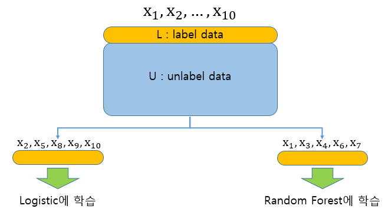
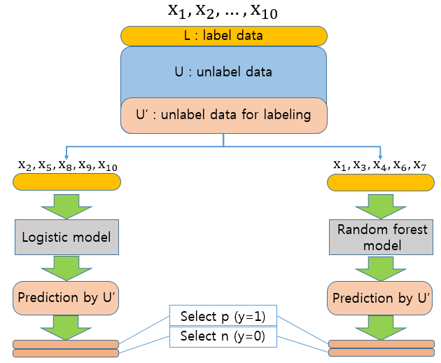
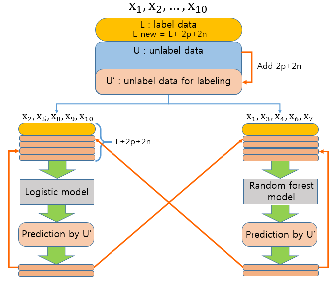
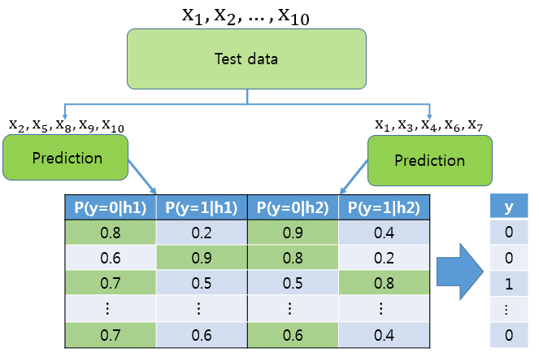

Business Analytics
============================
본 내용은 고려대학교 산업경영공학과 강필성 교수님의 Business Analytics강의를 바탕으로 제작하였습니다.
## Multi-view Algorithm (Co-training)
#### 2018020314 Jin Sae Jong


## Introduction

Semi-supervised learning 알고리즘은 공통적으로 모형을 만들 때 label된 자료만 사용하지 않고 unlabel된 데이터까지 같이 학습을 시켜서 예측력을 높이기 위해 사용하는 알고리즘입니다.

이러한 알고리즘에는 Self-training이나 Generative Model등 다양한 알고리즘이 있지만 이번 posting에서는 Multi-view algorithm(Co-Training)에 대해서 설명하도록 하겠습니다.

Multi-view algorithm(Co-Training)의 가장 큰 특징은 예측 모형을 만들기 위해 두개 이상의 다른 모형을 만드는 것입니다. 이러한 점에서는 앙상블(ensemble)모형과 비슷하지만 Multi-view algorithm에서는 서로 다른 모형에 학습을 시킬 때 feature(독립변수,설명변수)를 split해서 학습을 시킵니다.

또한 한번 만들어진 모형을 그대로 사용하는 Ensemble과 달리 Multi-view algorithm은 만들어진 모형에 unlabel된 데이터를 계속 추가시켜서 모형을 계속 update하게 됩니다.

Multi-view algorithm과 Ensemble 모형의 차이를 정리하면 다음과 같습니다.

| Ensemble | Multi-view algorithm |
|---|---|
| Supervised learning | Semi-supervised learning |
| data를 resampling함으로써 모형을 여러개 만듦 | unlable된 데이터를 (label을 붙여서)계속 추가시켜서 모형을 update함 |
| 각 모형에 (train) data를 모두 사용 | 각 모형에 사용하는 (train) data의 갯수를 천천히 증가시킴 |
| 각 모형에 사용되는 변수가 중복이 됨 | 각 모형에 사용되는 변수가 중복이 되지 않음 | 
| 최대로 만들 수 있는 모형의 갯수는 무한하다 | 최대로 만들 수 있는 모형의 갯수는 독립변수의 갯수이다 |


## Multi-view Algorithm (Co-training)

여러분이 일식을 뜻하는 eclipse와 자동차 종류 중 하나인 eclipse를 구분하기 위한 모형을 만들기 위해 여러가지 자료를 모았다고 가정해 봅시다. 


(사진 출처 : 고려대학교 산업경영공학과 강필성 교수님 Business Analytics 강의자료 53쪽)

그런데 자료를 모으는데 하나는 이미지 data고 하나는 텍스트 data입니다. 

모형을 만드는데 사용할 수 있는 설명변수(독립변수)가 많으면 예측을 하는데 좀 더 좋은 performance를 낼 가능성이 큽니다. 하지만 이미지 data와 텍스트 data를 동시에 설명변수로 삼아서 모형을 만드는 것은 매우 어려운 일입니다.

이미지 데이터를 분석하는데는 대표적으로 CNN(convolutional neural network)알고리즘이 많이 알려져 있으며 텍스트데이터를 분석하는데는 여러 텍스트 마이닝 기법들이 알려져 있습니다. 따라서 설명변수들을 한꺼번에 사용하지 않고 각각 설명변수 특징에 적합한 알고리즘을 사용하여 모형을 만드는 알고리즘이 바로 Multi-view Algorithm입니다.


## Algorithm (Co-training)

아래 그림들은 고려대학교 산업경영공학과 강필성 교수님의 Business Analytics강의 및 강의 자료를 바탕으로 자체제작하였습니다.

## 1) Feature split 



먼저 train data를 label된 데이터 L 와 unlabel된 data U로 나눕니다.

그 다음 K개의 설명변수들 중 어떤 변수를 어떤 모형 에 학습을 시킬 지 결정합니다. 여기서는 자료를 logistic regression, random forest 두 모형을 가지고 분석을 시도한다고 가정해서 각각 모형에 학습을 시킬 설명변수를 둘로 나누기로 합니다.(여기서는 모형을 h1, h2라 칭하며 반응변수(종속변수, y값은 0과 1 두가지로 분류합니다.))

예를 들어 설명변수가 10개 있으면 그 중 5개의 변수는 logistic regression에 나머지 5개의 변수는 random forest에 사용하기로 합니다.

설명변수를 나눈 때 logistic regression에 사용하는 설명변수와 random forest에 사용하는 설명변수는 서로 독립적인 형태를 띄어야 합니다.


## 2) procedure 1




1. Unlabel data 중에서 학습된 모형에 labeling을 할 후보 U'를 unlabel된 data를 smapling하여 추출한다

2. 각각의 학습된 모형 (h1, h2)에 labeling할 후보 데이터 U'를 설명변수로 삼아서(당연히 h1과 h2에 입력되는 설명변수는 split되어 있어야 한다) 반응변수(종속변수, y값)를 예측한다. 

3. 각각의 모형에서 예측된 반응변수 들 중 0으로 예측되는 데이터 중 n개를 1로 예측되는 데이터 중 p개를 뽑는다.

4. n과 p를 뽑을 때는 각각 종속변수가 예측 될 확률(0과 1이 예측될 확률) 상위 n개, p개 만큼 고른다.


## 2) procedure 2


5. 각각의 모형에서 선택된 n개와 p개의 데이터를 labeling하고 L에 업데이트를 한다. 따라서 2n+2p(중복된 데이터가 없을 경우)개의 데이터가 새로 labeling된 L 데이터에 추가가 된다. (중복된 데이터가 있으면 중복이 되지 않게 만든다)

6. 그러면 U'데이터의 수는 중복된 데이터가 없을 경우 2n+2p만큼 줄어든다. 줄어든 데이터 만큼 U'데이터를 제외한 U 데이터에서 2n+2p개만큼 샘플링하여 U'에 추가한다.

7. 1~6을 여러변 반복하여 logistic regression과 random forest모형을 업데이트 한다. (반복횟수 지정 가능)

## 3) Prediction




Test data의 설명변수를 각각 모형에 맞게 split한 다음 예측을 한다.

이 때 모형 1과 모형 2의 예측이 같다면 그대로 예측 모형을 사용한다

만약 모형 1과 모형 2의 예측이 다르다면 각각의 예측확률을 더한 값이 큰 예측 값을 사용한다.

이에 대한 예시로 위의 예측 표의 두 번째 행을 보면 모형 1과 모형 2의 예측 값이 다르다. 따라서 각 모형에 예측값이 0일 확률을 더하면  P(y=0|h1)+P(y=0|h2)=0.6+0.8=1.4이고 예측값이 1일 확률을 더하면  P(y=1|h1)+P(y=1|h2)=0.9+0.2=0.11이므로 예측값이 0일 확률을 더한 값이 더 크기 때문에 예측값은 0으로 할당한다.

## Code
아래 코드는 전년도 Business Analytics 수업의 이준헌님의 코드를 참고하여 제작하였습니다.


```python
import random
import numpy as np

from sklearn.linear_model import LogisticRegression
from sklearn.ensemble import RandomForestClassifier

from sklearn.datasets import make_classification
from sklearn.metrics import classification_report
```


```python
N = 5000    # 자료의 갯수 지정
n_var = 10    # 모형을 만드는데 필요한 설명변수들의 갯수 지정
 
# 자료생성
X, y = make_classification(n_samples=N, n_features=n_var)
print(X[:5],y[:5]) # 자료가 잘 생성되었는 지 확인 (10개의 설명변수와 1개의 반응변수를 가지는 data가 생성되었다)
```

    [[ 0.96100098  0.22306647  1.36368405 -0.58990893 -1.079847    0.70031368
       1.12315776 -1.05397361 -0.96055575 -0.34439467]
     [-0.6956275   0.8127271  -1.21276119 -0.01882397  1.02969743 -0.76416452
      -1.10022787  0.5233776   0.29875406 -0.89688182]
     [ 0.67736917 -0.29712646  0.77897737 -0.01119373 -0.86675512  0.90936663
      -1.47650358  0.88945386  0.37036342 -1.33910108]
     [ 0.73147102 -0.32154204  1.41488847 -0.6897175  -1.35853156  1.2119359
       0.91155131  0.3276848   1.88871466  1.5373407 ]
     [-1.40919671  0.91696984  0.56737884 -1.03412955 -0.48525878  0.36469027
      -0.04522229 -0.2238221   0.94267838  0.02025167]] [1 0 1 1 1]
    


```python
per_test = 10 # 전체 자료 중 10%의 instance(500개)를 test set으로 지정


random.seed(43)
test_index = random.sample(range(0,N),N*per_test//100)
train_index = list(set(range(0,N)) - set(test_index))

X_test = X[test_index]
y_test = y[test_index]

X_train = X[train_index]
y_train = y[train_index]

N_train = len(X_train)

per_label = 10 # 전체 train 자료(4500개) 중 10%의 instance(450개)에 label을 허용

label_index = random.sample(range(0,N_train),N_train*per_label//100)
unlabel_index = list(set(range(0,N_train)) - set(label_index))

y_train[unlabel_index] = -1 # unlable된 데이터의 y값은 -1로 할당
X_label = X_train[label_index]
y_label = y_train[label_index]


# 10개의 설명변수를 X1엔 4개 X2엔 6개씩 할당
X1_var_index = random.sample(range(0,n_var),4)
X2_var_index = list(set(range(0,n_var)) - set(X1_var_index))

X1_train = X_train[:,X1_var_index]
X2_train = X_train[:,X2_var_index]
```


```python
class CoTraining:

    def __init__(self, model1, model2, p, n, k, u):
        self.model1 = model1    # 첫 번째 모형
        self.model2 = model2    # 두 번째 모형
        self.p = p   # unlabel data에서 y=1 로 
        self.n = n   # unlabel data에서 y=0 으로 
        self.k = k   # 모형 update 반복 수 (unlable data의 일부를 label data로 바꾸는 횟수)
        self.u = u   # U'의 크기(자료의 갯수)
        
        # hyper parameter가 0보다 작은 경우 에러 메세지 출력
        assert(self.p > 0 and self.n > 0 and self.k > 0 and self.u > 0)


    def fit(self, X1, X2, y):  #Co-training 알고리즘

        # unlabel data(여기서는 y=-1)를 U에 할당
        U = [i for i, y_i in enumerate(y) if y_i == -1]
        
        # label을 붙이기 위한 후보 data(U') 를 랜덤으로 추출하기 위한 index 지정      
        U_= random.sample(range(0,len(U)),min(len(U), self.u)) 
        
        # Unlabeled data에서 U'에 할당된 data를 제외하고 새로운 U를 만들기 위한 index를 추출하는 코드
        U = list(set(range(0,len(U))) - set(U_))

        # label data(y값이 존재할 경우(-1이 아닐 경우))를 L에 할당
        L = [i for i, y_i in enumerate(y) if y_i != -1]
        
        # 반복횟수 변수 할당 
        it = 0 

        # k번 만큼 Unlabeled data를 Labeled data로 변화 시키는 알고리즘
        while it != self.k and U:
            it += 1
            
            # label data로 각 모형 생성
            self.model1.fit(X1[L], y[L])
            self.model2.fit(X2[L], y[L])
            
            # 위 코드에서 생성된 모형으로 unlabel된 data의 후보 (U')의 class를 예측함
            y1 = self.model1.predict(X1[U_])
            y2 = self.model2.predict(X2[U_])
            
            # 위 코드에서 생성된 모형으로 unlabel된 data의 후보 (U')의 각 class가 될 확률을 예측함
            y1_proba = self.model1.predict_proba(X1[U_])
            y2_proba = self.model2.predict_proba(X2[U_]) 
            
            # 두 Classifier의 예측 Class가 다른 data의 label은 확률을 0으로 할당해서 label을 붙이는 것을 방지함
            # 두 모형에서 예측 값이 다르면 확률이 아무리 높아도 문제가 생길 수 있어 모형을 update하고 다시 한 번 예측하기로 함
            for i, (y1_i, y2_i) in enumerate(zip(y1, y2)):
                if y1_i != y2_i:
                    y1_proba[i,:] = 0
                    y2_proba[i,:] = 0
            
            # 각 Classifier에서 예측값이 0, 1이 될 확률이 높은 상위 n, p의 index 추출
            idx_model1_n = np.argsort(y1_proba[:,0])[-self.n:]
            idx_model2_n = np.argsort(y2_proba[:,0])[-self.n:]
            idx_model1_p = np.argsort(y1_proba[:,1])[-self.p:]
            idx_model2_p = np.argsort(y2_proba[:,1])[-self.p:]
            
            # 각 예측값이 0, 1이 될 확률이 높은 index들을 하나의 배열로 정리
            n = list(idx_model1_n) + list(idx_model1_n)
            p = list(idx_model2_p) + list(idx_model2_p)
            n.sort()
            p.sort()
            
            # 중복값을 제거하고 unique한 값만 가지게 함
            n=list(set(n))
            p=list(set(p))
            
            # 각 class가 될 확률이 높은 상위 n,p개의 unlabel된 데이터를 labeling함
            y[[U_[x] for x in p]] = 1
            y[[U_[x] for x in n]] = 0
            
            # Labeling된 data를 Label data로 추가
            L.extend([U_[x] for x in p])
            L.extend([U_[x] for x in n])
            
            # Label data로 추가된 자료(index)를 U'에서 제거
            remove = p + n
            remove.sort()
            remove.reverse()

            for i in remove: 
                U_.pop(i)
            
            
            # U'에서 빠진만큼 Unlabeled data에서 채워 넣기(replenish)
            add_cnt = 0 
            num_to_add = len(remove)
            while add_cnt != num_to_add and U:
                add_cnt += 1
                U_.append(U.pop())

        # for문에서 추가된 data를 가지고 y깂 예측
        self.model1.fit(X1[L], y[L])
        self.model2.fit(X2[L], y[L])

    # 두개의 Classifier의 Class예측 확률의 합쳐서 최종 Class 예측
    def predict(self, X1, X2):

        y1 = self.model1.predict(X1)
        y2 = self.model2.predict(X2)
        
        y_pred=[-1]*len(y1)
        
        # 두 Classifier가 동일한 Class시 예측하면 해당 Class로 할당
        # 그렇지 않은 경우, 모든 모형에서 각 class가 될 확률을 더해 두 class 중 합이 높은 Class로 할당
        for i, (y1_i, y2_i) in enumerate(zip(y1, y2)):
            if y1_i == y2_i: 
                y_pred[i] = y1_i
            else:
                y1_probs = self.model1.predict_proba([X1[i]])
                y2_probs = self.model2.predict_proba([X2[i]])
                sum_y_probs = [prob1 + prob2 for (prob1, prob2) in zip(y1_probs, y2_probs)]
                max_sum_prob = max(sum_y_probs)
                y_pred[i] = sum_y_probs.index(max_sum_prob)
        return y_pred
    

```

생성된 code를 가지고 Co-training한 모형과 각각의 단일 모형과 비교해보았습니다.


```python
print ('CoTraining with Random forest and Logistic regression')
Co_train_model = CoTraining(RandomForestClassifier(n_estimators=100), LogisticRegression(), p=5, n=5, k=100, u=100)
Co_train_model.fit(X1_train, X2_train, y_train)
y_pred = Co_train_model.predict(X_test[:,X1_var_index], X_test[:,X2_var_index])
print (classification_report(y_test, y_pred, digits=3))

print ('Modeling with Random forest')
logisticreg = LogisticRegression()
logisticreg.fit(X_label, y_label)
y_pred = logisticreg.predict(X_test)
print (classification_report(y_test, y_pred, digits=3))

print ('Modeling with Logistic regression')
RandomForest = RandomForestClassifier(n_estimators=100)
RandomForest.fit(X_label, y_label)
y_pred = RandomForest.predict(X_test)
print (classification_report(y_test, y_pred, digits=3))
```

    CoTraining with Random forest and Logistic regression
                 precision    recall  f1-score   support
    
              0      0.950     0.901     0.925       253
              1      0.904     0.951     0.927       247
    
    avg / total      0.927     0.926     0.926       500
    
    Modeling with Random forest
                 precision    recall  f1-score   support
    
              0      0.954     0.901     0.927       253
              1      0.904     0.955     0.929       247
    
    avg / total      0.929     0.928     0.928       500
    
    Modeling with Logistic regression
                 precision    recall  f1-score   support
    
              0      0.969     0.870     0.917       253
              1      0.879     0.972     0.923       247
    
    avg / total      0.925     0.920     0.920       500
    
    

## Code analysis and Conclusion
세개의 모형을 비교한 결과 세 모형의 accuracy rate에 그렇게 큰 차이가 없는 것으로 나타났습니다.

이 이유는 첫 변째로 semi-supervised learning 자체가 큰 효과를 기대할 수 없기 때문이다.
또한 여기서 생성된 데이터의 설명변수는 10개 모두 logistic regression에 적합을 해도 문제가 없고 Random forest에 적합을 해도 크게 문제가 업으며 설명변수를 split할 때 무작위로 split을 하였기 때문에 split된 그룹 끼리 설명변수가 독립성을 보장하지 못합니다.

Co-training 방법이 큰 효과를 보이기 위해서는 처음에 설명했던 그림 데이터와 text 데이터끼리 spilt 해서 CNN모형과 텍스트마이닝에 학습을 시키는 것처럼 split된 설명변수가 각 모형에 특화된 방법이여야 본래의 효과를 발휘할 것입니다.
